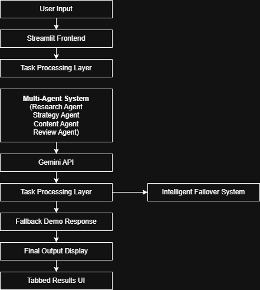

# 🤖 Multi-Agent Business Automation System

## 🔗 Live Demo
https://huggingface.co/spaces/shimanshushrivastava96/multi-agent-business-automation

## 🚀 Overview
This project is an AI-powered multi-agent system designed to automate business workflows using intelligent agents.

The system uses multiple AI agents that collaborate to perform tasks such as:
- Research automation
- Task execution
- Decision-making
- Workflow optimization

---

## 🧠 Key Features
- Multi-agent architecture
- Task orchestration
- AI-driven decision making
- Modular and scalable design

---

## 🏗️ Architecture


---

## 📂 Project Structure
- `code.py` → Main application logic
- `requirements.txt` → Dependencies
- `architecture-diagram.png` → System design
- `Output screenshots.docx` → Output samples

---

## ⚙️ Installation

```bash
pip install -r requirements.txt
python code.py
